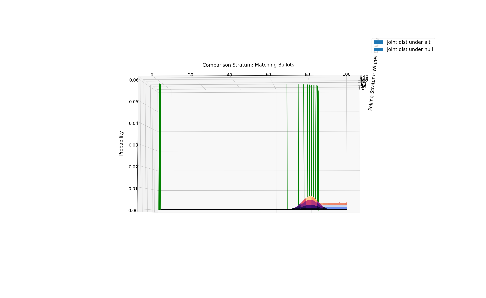
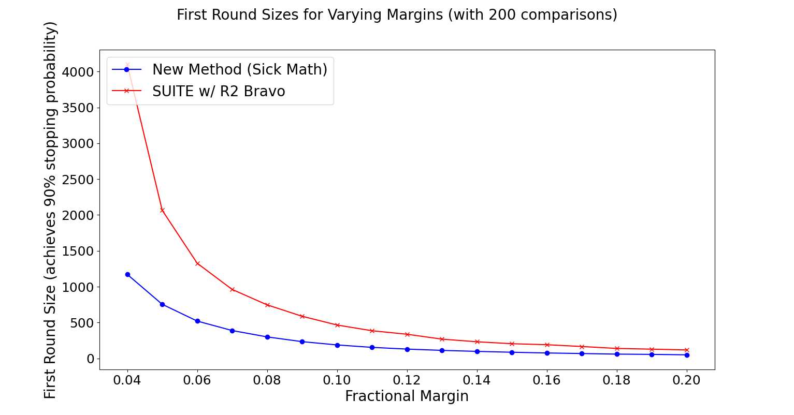

# new_stratified
My work developing and testing a new stratified audit approach.

## Context (my previous work)
Summer 2020, I worked on combining [SUITE](https://github.com/pbstark/CORLA18/tree/master/code) and [Athena](https://github.com/gwexploratoryaudits/r2b2/tree/master) for 2-strata audits. That work is in a [separate repo](https://github.com/obroadrick/stratified_athena/tree/master).

## The new idea
The new idea is to avoid the conservative p-values we get from using combining functions to combine distinct strata p-values. We will do this by combining probability distributions from individual strata into one joint probability distribution. Then, a stopping condition, similar to that presented in [Athena](https://arxiv.org/abs/2008.02315), will be used.

## How it works
The clever "tail" ratio used in the Athena class of risk-limiting audits uses a likelihood ratio test. To take advantage of this sick math, we need to frame the 2-strata audit (comparison and ballot polling) to also be a likelihood ratio. The likelihood ratio is a ratio of the the probability of a given sample under the alternative hypothesis to the likelihood of that sample under the null hypothesis. Thus, we need a probability distribution over possible samples in each stratum under each hypothesis. For ballot polling, this is easy and familiar. We use the binomial distribution over the number of winner votes in a sample with p set to the reported winner proportion of votes for the alternative hypothesis. For the comparison stratum, we use (for now, and for proof of concept rather than efficiency) a uniform distribution over all matches under the alternative hypothesis. But what about the null hypothesis? It's a bit trickier. Similar to what's done in SUITE, we need to maximize the probability of our sample occuring under the null hypothesis by testing all possible error allocations across both strata. Rather than framing the maximization problem around the number of overvotes (like is done in SUITE), we frame it around the number of winner votes in each stratum. The sum of the winner votes across both strata must be half (rounded down) of the total ballots cast. This is the tie case/most difficult to detect case that makes our audit risk-limiting (as discussed in Prof Vora's Bayesian RLA paper that I will link here when I'm less lazy at some point). Once this maximization is done, we have null distributions as well (binomial distributions where p is whatever the maximization decided it is), and thus we have discrete probability distributions that will tell us for any sample of winner votes (k_w) from the polling stratum and any sample of matching votes (k_m) from the comparison stratum, the probability of each of these samples under the alternative and null hypotheses:
```
Pr[K_w = k_w | alternative]
Pr[K_w = k_w | null]
and
Pr[K_m = k_m | alternative]
Pr[K_m = k_m | null]
```
Note that these are independent samples and thus the probability of this specific pair of samples is 
```
Pr[K_w = k_w, K_m = k_m | alternative] = Pr[K_w = k_w | alternative] * Pr[K_m = k_m | alternative]
Pr[K_w = k_w, K_m = k_m | null] = Pr[K_w = k_w | null] * Pr[K_m = k_m | null]
```
So now we have this pretty joint probability distribution over all possible samples (for now, just in the first round) from both strata. The likelihood ratio is now clear:
```
Pr[K_w = k_w, K_m = k_m | alternative] 
---------------------------------------
Pr[K_w = k_w, K_m = k_m | null] 
```
We stop when this ratio is above 1 over alpha (the risk limit). From here we can have a simple audit that continues to update this same distribution by increasing the sample size for future rounds, or we can Minerv-ize it by taking the ratio of the tails and thus ultimately having a more efficient audit. So why no do that! Our ratio becomes:
```
sum(Pr[K_w = k_w, K_m = k_m | alternative])
---------------------------------------
sum(Pr[K_w = k_w, K_m = k_m | null])
```
Where each sum is from the observed sample to the end of the distribution (just the tail of the distribution). Now stop the audit when this ratio is greater than 1 over alpha and you will still be running a risk-limiting audit, but your required sample size will almost always be lower! Sick math indeed.

Here is a terrible angle showing the 3-d plot of the joint probability distribution over winner votes in the polling stratum and matching votes in the comparison stratum.


## Some preliminary results
Here is a plot of first round sizes that achieve a 90% stopping probability
for a stratified audit with two strata: ballot polling, ballot level comparison.
I include both the round sizes achieved by this new method and those
of SUITE with R2 Bravo.

